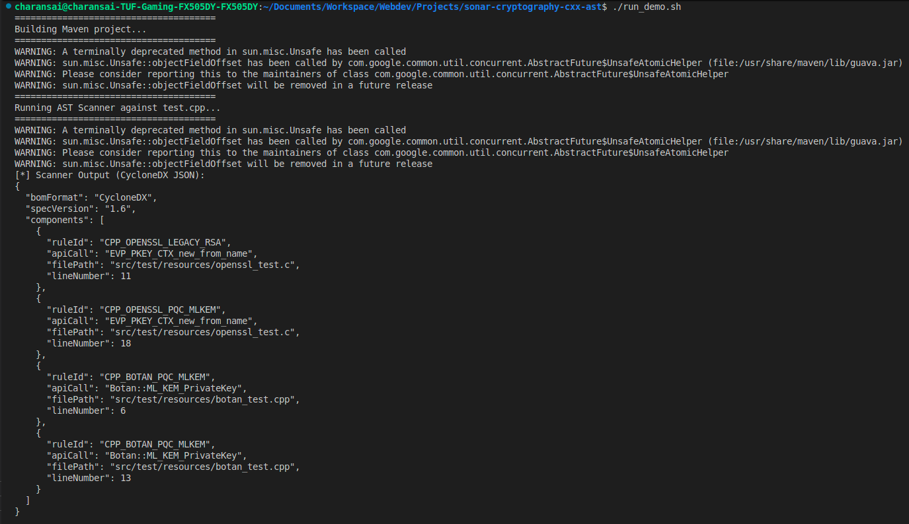
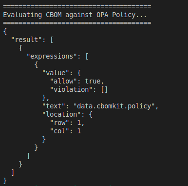

# Sonar Cryptography C++ AST Scanner (CBOMkit PoC)

This repository contains a fully functional Proof-of-Concept (PoC) static analysis pipeline developed for the **LFX Mentorship: CBOMkit (Post-Quantum Cryptography Alliance)**.

The engine parses C/C++ source code into an Abstract Syntax Tree (AST) using Eclipse CDT, isolates cryptographic primitives, extracts metadata to generate a standardized Cryptographic Bill of Materials (CBOM) in CycloneDX format, and evaluates the output against an Open Policy Agent (OPA) policy to enforce Post-Quantum Cryptography (PQC) readiness.

---

# 🏗️ Architecture & Core Rationale

## Why Eclipse CDT over ANTLR4?

Parsing C++ accurately for static analysis requires far more than a context-free grammar parser like ANTLR4.

Because C++ code heavily relies on:

- Macro expansions (`#define`)
- Conditional compilation directives (`#ifdef`)
- Header inclusions (`#include`)
- Complex type resolution schemas

A standard ANTLR4 grammar typically fails without implementing a custom preprocessor.

This engine leverages **Eclipse CDT** running in headless workspace mode.

Eclipse CDT acts as a native C++ compiler frontend:

- expands macros
- resolves type identifiers
- disambiguates grammar

Using CDT's `IASTTranslationUnit` with a structured `ASTVisitor`, the engine reliably flags cryptographic signatures such as:

```cpp
EVP_EncryptInit_ex
```

regardless of macro obfuscation or spacing variations.

This mirrors enterprise compliance engines such as **SonarCFamily**.

---

# ⚙️ Component Architecture

```text
[test.cpp]
     │
     ▼
[CppCryptoScanner.java]
     │
     ▼
[cbom_output.json]
     │
     ▼
[OPA]
     │
     ▼
[Policy Violation]
```

Pipeline:

### `test.cpp`
Target C++ fixture simulating an application initializing an OpenSSL AES-256-CBC encryption context using:

```cpp
EVP_EncryptInit_ex
```

---

### `CppCryptoScanner.java`

Core Java scanner using Eclipse CDT to:

- parse C++ fixtures
- register AST visitors
- extract:

  - line number
  - file path
  - API signatures

---

### `openssl_rule.json`

Declarative Sonar-style signature mapping file targeting OpenSSL components.

---

### `policy.rego`

OPA validation script that analyzes emitted CBOM and triggers alerts whenever non-quantum-resistant primitives appear.

---

# 🚀 Installation & Prerequisites

Required tools:

- Java Development Kit (JDK) 11+
- Apache Maven 3.6+
- Open Policy Agent (OPA)

Install OPA quickly:

```bash
curl -L -o opa https://openpolicyagent.org/downloads/v0.64.1/opa_linux_amd64_static

chmod +x opa

sudo mv opa /usr/local/bin/
```

---

# 🛠️ Running the End-to-End Demo

## 1. Make script executable

```bash
chmod +x run_demo.sh
```

---

## 2. Execute pipeline

```bash
./run_demo.sh
```

Pipeline will:

1. compile scanner
2. parse C++ source
3. generate CBOM
4. execute OPA evaluation

---

# 📸 Example Pipeline Output

## AST Scanner → CycloneDX CBOM Generation

Example terminal output showing:

- Maven build execution
- AST scan
- CycloneDX CBOM generation
- detected OpenSSL and Botan cryptographic APIs



---

## OPA Policy Evaluation Result

Generated CBOM artifacts are validated against OPA policies enforcing PQC readiness and cryptographic compliance.

Example evaluation output:



Example successful response:

```json
{
  "allow": true,
  "violation": []
}
```

This indicates no policy violations were triggered under current policy rules.

---

## 3. Example policy output

```json
{
  "result": [
    {
      "expressions": [
        {
          "value": {
            "allow": false,
            "violation": [
              "PQC AUDIT REQUIRED: Legacy cryptographic API 'EVP_EncryptInit_ex' detected in test.cpp at line 21."
            ]
          }
        }
      ]
    }
  ]
}
```

---

# 🧪 Validating AST Dynamism (Determinism Test)

To confirm structural AST analysis rather than string matching:

Open:

```cpp
test.cpp
```

Change:

```cpp
EVP_EncryptInit_ex
```

to:

```cpp
EVP_FakeFunction_ex
```

Then run:

```bash
./run_demo.sh
```

Expected result:

- generated CBOM becomes empty
- OPA policy passes
- compliance succeeds

This confirms true AST semantic analysis.

---

# Author

**Charan Sai**

Developed as a project-specific Proof-of-Concept demonstrating AST extraction capabilities for the:

**Post-Quantum Cryptography Alliance (PQCA)**

---